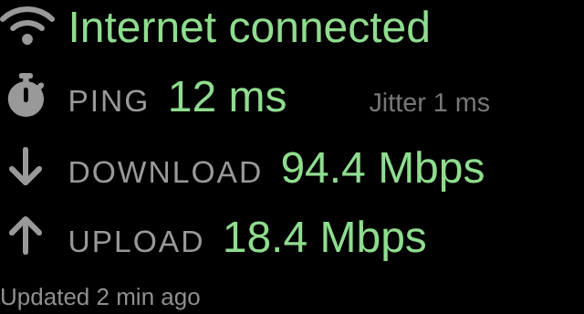
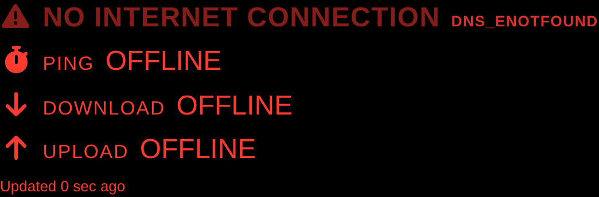
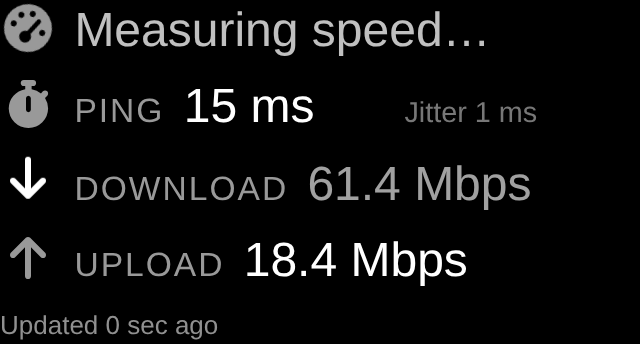

# MMM-NetworkStatus

A text-and-icons-only [MagicMirror²](https://magicmirror.builders/) module that tells you at a glance whether your mirror is online, and periodically measures **ping**, **download speed** and **upload speed**.

It is the spiritual successor of the no longer available `MMM-NetworkConnection`.



When the internet connection is gone, the whole block turns **red** and shows a blinking warning instead of stale numbers.



---

## Highlights

- **No images, no gauges, no charts.** Just text and Font Awesome icons, so it blends into any MagicMirror theme.
- **Live "measuring" animation.** While a test runs, the numbers count up and the active row pulses, so it is immediately obvious that a measurement is in progress — not a frozen value.
- **Loud offline warning.** No connection ⇒ red text + blinking warning line + the reason code (e.g. `DNS_ENOTFOUND`).
- **Uses the official Ookla Speedtest CLI when available**, and automatically falls back to other engines — it also works with **zero extra software installed**.
- **Two independent intervals**: a cheap connectivity/ping check (default every 30 s) and an expensive full speed test (default every 30 min).
- **25 languages** included, with automatic selection from the MagicMirror `language` setting.
- **Zero npm dependencies.** Nothing to install, nothing to keep updated.
- Colour hints (good / warn / bad) based on configurable thresholds.

---

## Screenshots

| State | Preview | What you see |
| --- | --- | --- |
| **Online, idle** |  | `Internet connected` plus ping / download / upload with the last measured values. Colours reflect the configured thresholds. |
| **Measuring** |  | The active row pulses and its number counts upward with a trailing `…`, so you can see a test is running. |
| **Offline** |  | Everything red, blinking `NO INTERNET CONNECTION` warning, values replaced by `OFFLINE`, plus the reason code. |

> **Try it without MagicMirror:** open [`docs/preview.html`](docs/preview.html) in any browser.
> It renders the real module code and CSS with a stubbed MagicMirror runtime, has buttons for all
> three states and a dropdown to preview every one of the 25 languages.

---

## Installation

```bash
cd ~/MagicMirror/modules
git clone https://github.com/Ryuto-dev/MMM-NetworkStatus.git
```

That is all — the module has **no npm dependencies**, so there is no `npm install` step.

Then add it to the `modules` array in `~/MagicMirror/config/config.js`:

```js
{
  module: "MMM-NetworkStatus",
  position: "top_left",
  header: "Network",
  config: {
    // all options are optional, see the table below
    updateInterval: 30 * 1000,
    speedTestInterval: 30 * 60 * 1000
  }
}
```

Restart MagicMirror and you are done.

### Recommended: install the official Ookla Speedtest CLI

The module works out of the box, but for the most accurate numbers install the free
[**Ookla Speedtest CLI**](https://www.speedtest.net/apps/cli). The module then reads
its live progress stream, which drives the counting animation with real data.

**Raspberry Pi OS / Debian / Ubuntu**

```bash
curl -s https://packagecloud.io/install/repositories/ookla/speedtest-cli/script.deb.sh | sudo bash
sudo apt-get install speedtest
# Accept the license once for the user MagicMirror runs as:
speedtest --accept-license --accept-gdpr
```

**macOS**

```bash
brew tap teamookla/speedtest
brew install speedtest --force
```

> **Note:** the Ookla CLI is proprietary freeware provided by Ookla, LLC and requires accepting
> their [license](https://www.speedtest.net/about/eula) and
> [privacy policy](https://www.speedtest.net/about/privacy) on first run. The module passes
> `--accept-license --accept-gdpr` automatically (disable with `acceptSpeedTestLicense: false`).
> The Ookla CLI is **not** bundled with this module.

---

## Measurement engines

The module auto-detects the best available engine at startup. You can force one with `speedTestEngine`.

| Engine | `speedTestEngine` | Requirement | Live progress | Notes |
| --- | --- | --- | --- | --- |
| **Ookla Speedtest CLI** | `"ookla"` | `speedtest` binary | ✅ real-time | Recommended. Most accurate, streams JSONL progress. |
| speedtest-cli (Python) | `"speedtest-cli"` | `speedtest-cli` binary | ⚠️ synthetic | Popular community client. |
| librespeed-cli | `"librespeed"` | `librespeed-cli` binary | ⚠️ synthetic | Open-source, self-hostable servers. |
| **Built-in HTTP fallback** | `"http"` | nothing | ✅ real-time | Streams from Cloudflare's speed endpoints. Works everywhere, slightly less precise. |
| Auto-detect | `"auto"` *(default)* | — | — | Tries Ookla → speedtest-cli → librespeed → HTTP. |

Latency is measured with the system `ping` binary (ICMP). If ICMP is unavailable or filtered
(common inside Docker), the module transparently falls back to a TCP-handshake measurement.

---

## Configuration options

All options are optional. Defaults are shown.

### Scheduling

| Option | Type | Default | Description |
| --- | --- | --- | --- |
| `updateInterval` | number (ms) | `30 * 1000` | How often connectivity + ping are checked. Minimum 5 s. |
| `speedTestInterval` | number (ms) | `30 * 60 * 1000` | How often a full speed test runs. Minimum 60 s. Keep this high — a speed test saturates your line. |
| `initialSpeedTestDelay` | number (ms) | `5 * 1000` | Delay after boot before the first speed test. |
| `pauseWhenHidden` | boolean | `true` | Stop measuring while the module is hidden by another module. |
| `animationSpeed` | number (ms) | `500` | MagicMirror DOM fade speed on updates. |

### What to display

| Option | Type | Default | Description |
| --- | --- | --- | --- |
| `showStatus` | boolean | `true` | Show the connected / offline status line. |
| `showPing` | boolean | `true` | Show the ping row. |
| `showDownload` | boolean | `true` | Show the download row. |
| `showUpload` | boolean | `true` | Show the upload row. |
| `showIcons` | boolean | `true` | Show the Font Awesome icons. |
| `showLabels` | boolean | `true` | Show the text labels (`PING`, `DOWNLOAD`, …). |
| `showJitter` | boolean | `false` | Append jitter to the ping row. |
| `showPacketLoss` | boolean | `false` | Append packet loss to the ping row. |
| `showServerInfo` | boolean | `false` | Show the speed test server in the footer. |
| `showLastUpdated` | boolean | `false` | Show "Updated 5 min ago" in the footer. |

### Appearance

| Option | Type | Default | Description |
| --- | --- | --- | --- |
| `layout` | string | `"vertical"` | `"vertical"`, `"horizontal"` or `"compact"` (single line, labels hidden). |
| `alignment` | string | `"left"` | `"left"`, `"center"` or `"right"`. |
| `fontSize` | string | `"medium"` | `"xsmall"`, `"small"`, `"medium"` or `"large"`. |
| `speedUnit` | string | `"auto"` | `"auto"`, `"bps"`, `"kbps"`, `"Mbps"`, `"Gbps"`, `"kB/s"`, `"MB/s"`, `"GB/s"` or `"bytes"` (auto-scaled bytes). |
| `speedDecimals` | number | `1` | Decimal places for speeds (0–4). |
| `pingDecimals` | number | `0` | Decimal places for latency (0–4). |
| `colorizeValues` | boolean | `true` | Colour values green / amber / red based on the thresholds below. |
| `icons` | object | see below | Font Awesome classes per state. |

```js
icons: {
  online:   "fa-solid fa-wifi",
  offline:  "fa-solid fa-triangle-exclamation",
  ping:     "fa-solid fa-stopwatch",
  download: "fa-solid fa-arrow-down",
  upload:   "fa-solid fa-arrow-up",
  testing:  "fa-solid fa-gauge-high"
}
```

### Animation

| Option | Type | Default | Description |
| --- | --- | --- | --- |
| `animateMeasurement` | boolean | `true` | Enable the counting-up / pulsing "measuring" animation. |
| `countUpDuration` | number (ms) | `900` | How long a finished value counts up to its final number. |
| `liveUpdateFps` | number | `12` | Animation frame rate (1–30). Lower it on a Raspberry Pi Zero. |

> The CSS also honours `prefers-reduced-motion`, so all animations are disabled automatically
> for users who request reduced motion at the OS level.

### Thresholds (colour hints)

| Option | Type | Default | Description |
| --- | --- | --- | --- |
| `pingThresholds` | object | `{ warn: 80, bad: 200 }` | Milliseconds. Lower is better. |
| `downloadThresholds` | object | `{ warn: 20, bad: 5 }` | **Mbps**. Higher is better. |
| `uploadThresholds` | object | `{ warn: 10, bad: 2 }` | **Mbps**. Higher is better. |

### Measurement backend

| Option | Type | Default | Description |
| --- | --- | --- | --- |
| `speedTestEngine` | string | `"auto"` | See the engine table above. |
| `acceptSpeedTestLicense` | boolean | `true` | Pass `--accept-license --accept-gdpr` to the Ookla CLI. |
| `speedTestServerId` | string/number | `null` | Pin the Ookla server (`speedtest --servers` lists ids). |
| `speedTestExtraArgs` | array | `[]` | Extra CLI arguments, e.g. `["--interface=eth0"]`. |
| `speedTestTimeout` | number (ms) | `180 * 1000` | Hard timeout for one speed test. |
| `pingHost` | string | `"1.1.1.1"` | Host used for latency measurement. |
| `pingCount` | number | `3` | Number of echo requests (1–20). |
| `pingMethod` | string | `"auto"` | `"auto"`, `"icmp"` or `"tcp"`. |
| `pingTcpPort` | number | `443` | Port used by the TCP fallback. |
| `pingTimeout` | number (ms) | `8 * 1000` | Timeout of the whole ping run. |
| `connectivityHost` | string | `"one.one.one.one"` | Host for the DNS reachability check. |
| `connectivityUrl` | string | `"https://www.google.com/generate_204"` | URL for the HTTP reachability check. |
| `connectivityTimeout` | number (ms) | `5 * 1000` | Timeout of the connectivity check. |
| `httpFallback` | object | `{}` | Tuning of the built-in HTTP engine (see below). |

```js
httpFallback: {
  downloadUrl:   "https://speed.cloudflare.com/__down?bytes=25000000",
  uploadUrl:     "https://speed.cloudflare.com/__up",
  uploadBytes:   5 * 1024 * 1024,
  maxDurationMs: 10000
}
```

---

## Example configurations

**Minimal, compact one-liner in the top bar**

```js
{
  module: "MMM-NetworkStatus",
  position: "top_bar",
  config: {
    layout: "compact",
    fontSize: "small",
    showStatus: false,
    speedUnit: "Mbps"
  }
}
```

**Full detail with the Ookla CLI pinned to one server**

```js
{
  module: "MMM-NetworkStatus",
  position: "bottom_left",
  header: "Internet",
  config: {
    speedTestEngine: "ookla",
    speedTestServerId: 28910,
    speedTestInterval: 60 * 60 * 1000,
    showJitter: true,
    showPacketLoss: true,
    showServerInfo: true,
    showLastUpdated: true
  }
}
```

**Low-power Raspberry Pi Zero (fewer animation frames, rare tests)**

```js
{
  module: "MMM-NetworkStatus",
  position: "top_right",
  config: {
    updateInterval: 60 * 1000,
    speedTestInterval: 3 * 60 * 60 * 1000,
    liveUpdateFps: 5,
    countUpDuration: 400
  }
}
```

**Connectivity warning only (no speed testing at all)**

```js
{
  module: "MMM-NetworkStatus",
  position: "top_center",
  config: {
    showDownload: false,
    showUpload: false,
    showPing: true,
    fontSize: "large"
  }
}
```

---

## Notifications

You can trigger a measurement from another module or from the developer console.

| Notification | Effect |
| --- | --- |
| `NETWORK_STATUS_FORCE_CHECK` | Run a connectivity + ping check right now. |
| `NETWORK_STATUS_FORCE_SPEEDTEST` | Run a full speed test right now. |

```js
// from another module
this.sendNotification("NETWORK_STATUS_FORCE_SPEEDTEST");
```

---

## Translations

The module ships with 25 languages and follows the global `language` setting of your
MagicMirror config. English is used as fallback for anything not translated.

`ar` · `cs` · `da` · `de` · `en` · `es` · `fi` · `fr` · `hi` · `hu` · `id` · `it` · `ja` ·
`ko` · `nb` · `nl` · `pl` · `pt` · `pt-br` · `ru` · `sv` · `tr` · `uk` · `zh_cn` · `zh_tw`

### Adding or fixing a language

All languages live in one table so they never drift apart:

1. Edit `scripts/build-translations.js` and add your language to the `TRANSLATIONS` object.
2. Register the file in `getTranslations()` inside `MMM-NetworkStatus.js`.
3. Regenerate and verify:

   ```bash
   node scripts/build-translations.js
   npm run check
   ```

Pull requests with new languages are very welcome.

---

## Troubleshooting

| Symptom | Cause / fix |
| --- | --- |
| Ping shows `-- ms` but the status says connected | ICMP is blocked. Set `pingMethod: "tcp"`. |
| Speeds stay at `--` | No engine could run. Check the MagicMirror log; the reason is shown in the footer. Try `speedTestEngine: "http"`. |
| Footer shows `Speed test failed: SPEEDTEST_FAILED` right after installing the Ookla CLI | The license was not accepted yet. Run `speedtest --accept-license --accept-gdpr` once as the MagicMirror user. |
| Shows offline although the browser works | Your network blocks `https://www.google.com/generate_204`. Point `connectivityUrl` at something reachable (e.g. your router). |
| Numbers never animate | `animateMeasurement: false`, or the OS requests reduced motion. |
| Speed test seems to slow down streaming | It does — a speed test saturates the line. Increase `speedTestInterval`. |

Enable verbose logs by starting MagicMirror with `npm start dev` and watching the console.

---

## Data usage warning

A full speed test transfers a significant amount of data (typically 50–500 MB depending on your
line speed and engine). With the default 30-minute interval this can add up to several GB per day.
**On a metered or mobile connection, increase `speedTestInterval` or disable speed testing** by
setting `showDownload: false` and `showUpload: false` — connectivity and ping monitoring then keeps
running almost for free.

---

## Development

```bash
npm run lint     # dependency-free syntax + translation consistency checks
npm test         # 50 unit tests (node:test, no dependencies)
npm run check    # both
```

- `MMM-NetworkStatus.js` — frontend module: state machine, formatting, DOM and animation
- `node_helper.js` — backend: scheduling, connectivity, ping and speed test orchestration
- `lib/format.js` — pure formatting helpers (shared by browser, Node and tests)
- `lib/parsers.js` — parsers for every engine's output and for `ping`
- `lib/probes.js` — the actual measurements
- `docs/preview.html` — standalone visual preview of all states, no MagicMirror needed

---

## Credits

- Inspired by the discontinued `MMM-NetworkConnection` module.
- Optional speed measurement via the [Ookla® Speedtest® CLI](https://www.speedtest.net/apps/cli),
  [speedtest-cli](https://github.com/sivel/speedtest-cli) or
  [librespeed-cli](https://github.com/librespeed/speedtest-cli).
  Ookla, Speedtest and the Speedtest logo are trademarks of Ookla, LLC.
- Icons by [Font Awesome](https://fontawesome.com/), which ships with MagicMirror².

## License

[MIT](LICENSE)
